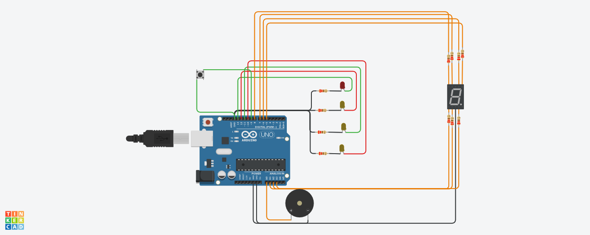

# PROYECTO GRUPAL SPD

### Alumno
+ Alejandro Tomas Falanga

### Integrantes del grupo
+ Flores Brandon
+ Corimayo Alan
+ Falanga Alejandro
+ Fleitas Ezequiel 
+ Yapura Franco

## Proyecto: Linea de subte 


## Descripcion 
El proyecto consiste en una linea de subte simulada mediante un arduino, funcionando con 4 leds, un pienzo y un display de 7 segmentos

## Funcion principal 
Mediante el uso de funciones, el codigo intenta simular la llegada del subte a las distintas estaciones. al llegar a algunade las cuatro estaciones, su respectivo led se encendera, acompañado de un pienzo el cual lo notificara de forma sonora y un display 7 segmentos el cual ira mostrando las cantidad de paradas restantes para llegar a "constitucion"

## loop del codigo
```
void loop()
{
  	if(digitalRead(boton) == LOW)
    { 
      	Serial.println("Usted esta en moreno. Siguiente destino: Independencia");
    	more();
      	Serial.println("Usted llego a Independencia. Siguiente destino: San Juan");
  		inde();
      	Serial.println("Usted llego a san juan. Siguiente destino: Constitucion");
  		san();
      	Serial.println("Usted llego a constitucion.");
  		consti();
    }
}
```
## Funciones 
```
void consti()
{
  	tone(Piezo,250,500);
   	digitalWrite(CONSTITUCION, HIGH);
   	digitalWrite(B, HIGH);
  	digitalWrite(A, HIGH);
  	digitalWrite(E, HIGH);
  	digitalWrite(D, HIGH);
  	digitalWrite(F, HIGH);
  	digitalWrite(C, HIGH);	
  	delay(10000);
  	digitalWrite(CONSTITUCION, LOW);
  	digitalWrite(B, LOW);
  	digitalWrite(A, LOW);
  	digitalWrite(E, LOW);
  	digitalWrite(D, LOW);
  	digitalWrite(F, LOW);
  	digitalWrite(C, LOW);
  	delay(10000);

}

void san()
{	tone(Piezo,500,500);
  	digitalWrite(SAN_JUAN, HIGH);
 	digitalWrite(B, HIGH);
   	digitalWrite(C, HIGH);
  	delay(10000);
  	digitalWrite(SAN_JUAN, LOW);
 	digitalWrite(B, LOW);
   	digitalWrite(C, LOW);
  	delay(10000);
}

void inde()
{
  	tone(Piezo, 750, 500);
  	digitalWrite(INDEPENDENCIA, HIGH);
 	digitalWrite(B, HIGH);
  	digitalWrite(A, HIGH);
  	digitalWrite(G, HIGH);
  	digitalWrite(D, HIGH);
  	digitalWrite(E, HIGH);
 	delay(10000);
  	digitalWrite(INDEPENDENCIA, LOW);
 	digitalWrite(B, LOW);
  	digitalWrite(A, LOW);
  	digitalWrite(G, LOW);
  	digitalWrite(D, LOW);
  	digitalWrite(E, LOW);
  	delay(10000);
}

void more()
{
  	tone(Piezo,1000,500);
  	digitalWrite(MORENO, HIGH);
	digitalWrite(B, HIGH);
  	digitalWrite(A, HIGH);
  	digitalWrite(G, HIGH);
  	digitalWrite(D, HIGH);
  	digitalWrite(C, HIGH);
    delay(10000);
  	digitalWrite(MORENO, LOW);
  	digitalWrite(B, LOW);
  	digitalWrite(A, LOW);
  	digitalWrite(G, LOW);
  	digitalWrite(D, LOW);
  	digitalWrite(C, LOW);
  	delay(10000);
}
```
## Proyecto
[Link al Tinkercard](https://www.tinkercad.com/things/7Qgv4MRVNcy)